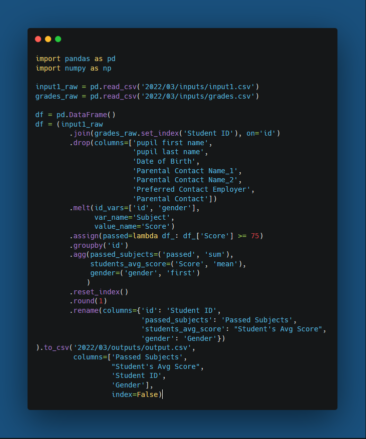

# 2022 Week 3
[The Prep School - Passing Grades](https://preppindata.blogspot.com/2022/01/2022-week-3-prep-school-passing-grades.html)

January 19, 2022

[](challenge03.py)

## Things I learned/practiced
This was a fun one and pretty straightforward for me (probably because there were no dates!) with a simple join, some reshaping with melt, and some groupby named aggregations.

* One annoying issue I found was with the Pylance extension in VS Code. It complained about my named aggregations for some reason saying:

    ```
    No overloads for "agg" match the provided arguments
    Argument types: (tuple[Literal['passed'], Literal['sum']], tuple[Literal['Score'], Literal['mean']], tuple[Literal['gender'], Literal['first']])
    ```

    I don't really understand what this means and could only find [an unanswered Reddit post](https://www.reddit.com/r/learnpython/comments/rg1osh/issue_with_pylance_and_pandass_named_aggregation/) with the same problem when I googled the issue. I think it's a bug in the pylance type checker.

* I also accidentally learned while working on this challenge that if you triple tap Ctrl in windows it will highlight the mouse cursor.

* I also learned how to reply to a tweet with a link to another tweet (click the up arrow next to the like and retweet button to copy the link and then paste into the new tweet). Valuable skills!