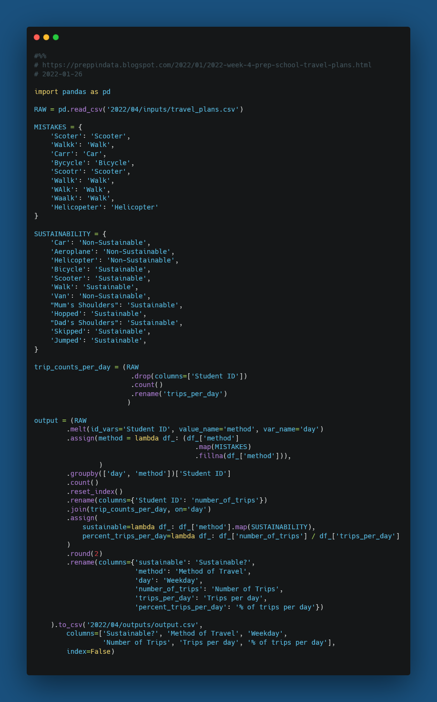

# 2022 Week 4
[The Prep School - Travel Plans](https://preppindata.blogspot.com/2022/01/2022-week-4-prep-school-travel-plans.html)

January 26, 2022


[](challenge04.py)


## Things I learned/practiced
* Use `map` on a series in pandas with a dict that doesn't cover all of the possible options. Replace the options that are in the dict, and then pass the rest unchanged:
```python
df_['col'].map(dict_map).fillna(df_['col'])
```
https://stackoverflow.com/a/41678874
